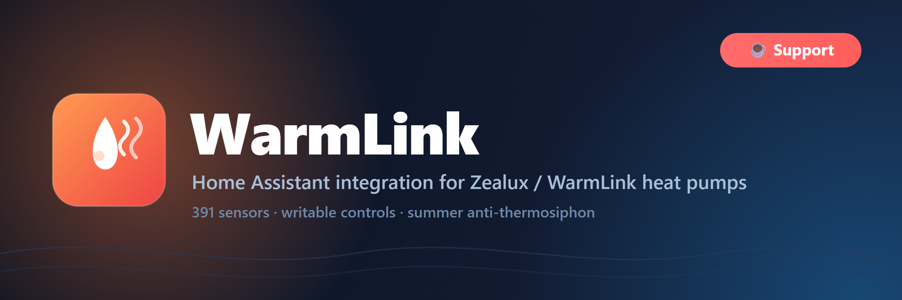

<p align="center">
  
</p>

# WarmLink Integration for Home Assistant

[](https://github.com/custom-components/hacs)
[](https://github.com/srbjessen/ha-warmlink/releases)
[](LICENSE)
[](https://ko-fi.com/srbjessen)

Home Assistant integration for WarmLink/Zealux heat pumps.

Monitor and control your WarmLink/Zealux heat pump directly from Home Assistant with comprehensive sensor coverage, fault code monitoring, and real-time updates.

> **Confirmed-compatible devices:** several brands rebadge the same LinkedGo cloud
> platform, and users have confirmed the integration working on them —
> Zealux · WarmLink · **WarmFlow Zeno (AS02-R32)**. If your heat pump uses the
> WarmLink/AquaTemp app, it very likely works even if it's not listed here; open
> an issue and we'll add it.

---

## Features

✅ **391 Sensors** - Complete monitoring of your heat pump
✅ **Writable Controls** - Set power, operating mode, and DHW target temperature
✅ **Summer Anti-Thermosiphon** - Park the 3-way diverter off the DHW tank via the Mode select to stop passive summer standby drain — for units affected by it ([guide below](#anti-thermosiphon-stop-summer-dhw-tank-drain-optional))
✅ **Fault Code Detection** - 41 fault codes including critical E035
✅ **Real-time Updates** - Automatic updates every 2 minutes
✅ **Manual Refresh** - On-demand data refresh button
✅ **Multi-language** - Danish and English support
✅ **No Data Gaps** - Intelligent caching for continuous graphs
✅ **Async Operations** - Non-blocking file I/O for performance

---

## Sensors

### Temperature Sensors (T01-T39)
- Water inlet/outlet temperatures
- Ambient temperature
- Coil temperatures
- Discharge/suction temperatures
- DHW temperatures
- Zone temperatures

### Pressure & Flow (P01-P20)
- System pressures
- Water flow rate
- Pump speeds

### Function Parameters (F01-F14)
- Fan speeds
- Heating curves
- Temperature targets
- Operating modes

### Timers (M1-M4)
- Mode settings
- Start/end times
- Temperature targets
- Power limits

### Schedules (W1-W5)
- Weekly schedules
- Time slots
- Mode configurations

### Fault Codes (E001-E045)
- Pressure protection (E001, E002, E035, E036)
- Compressor errors (E003, E025, E028, E040, E043)
- Temperature sensors (E005, E006, E015, E016, E020-E024, E029, E031, E032)
- Flow/Pump alarms (E004, E030)
- Electrical protection (E012, E026, E027, E041, E042)
- Communication errors (E011, E038)
- Inverter/Driver errors (E033, E037, E039, E044, E045)

### Smart Grid (SG01-SG20)
- Smart grid parameters
- Energy management

### Device Information
- Software versions
- Hardware information
- Operating hours
- System status

---

## Installation

### HACS (Recommended)

1. Open HACS in Home Assistant
2. Click the three dots in the top right corner
3. Select "Custom repositories"
4. Add this repository URL: `https://github.com/srbjessen/ha-warmlink`
5. Category: `Integration`
6. Click "Add"
7. Click "Install" on the WarmLink integration
8. Restart Home Assistant

### Manual Installation

1. Download the latest release from [Releases](https://github.com/srbjessen/ha-warmlink/releases)
2. Extract the files
3. Copy the `custom_components/warmlink` folder to your Home Assistant `config/custom_components/` directory
4. Restart Home Assistant

---

## Configuration

### Add Integration

1. Go to **Settings** → **Devices & Services**
2. Click **+ Add Integration**
3. Search for **WarmLink**
4. Enter your WarmLink credentials:
   - **Email**: Your WarmLink account email
   - **Password**: Your WarmLink account password
   - **Language**: `da` (Danish) or `en` (English)
   - **Device code** *(optional)*: leave blank to auto-detect. Required for **shared / "member" accounts** — see below.
5. Click **Submit**

#### Shared / "member" accounts

WarmLink allows only one concurrent login per account, so a common setup is to keep your main (owner) account for the app and add a **second account as a "member"** of the home for Home Assistant. Member accounts receive an **empty device list** from the WarmLink cloud, so auto-detection can't find the heat pump and setup fails.

To use a member account, fill in the **Device code**: open the WarmLink app → your heat pump → device information, and copy the device code (the module's long numeric ID). With it filled in, the integration talks to the device directly and works on member accounts.

### Entities

After setup, 391 sensors will be created automatically:

```
sensor.warmlink_water_inlet_temp_t01
sensor.warmlink_water_outlet_temp_t02
sensor.warmlink_ambient_temp_t04
sensor.warmlink_mode_state_modestate
sensor.warmlink_high_pressure_switch_protection_e035
button.warmlink_refresh_data
...and 385 more!
```

---

## Usage Examples

### Dashboard Card - Temperature Monitoring

```yaml
type: entities
title: Heat Pump Temperatures
entities:
  - entity: sensor.warmlink_water_inlet_temp_t01
    name: Inlet
  - entity: sensor.warmlink_water_outlet_temp_t02
    name: Outlet
  - entity: sensor.warmlink_ambient_temp_t04
    name: Ambient
```

### Manual Refresh Button

```yaml
type: button
entity: button.warmlink_refresh_data
name: Refresh Now
icon: mdi:refresh
tap_action:
  action: call-service
  service: button.press
  target:
    entity_id: button.warmlink_refresh_data
```

### Fault Code Monitoring

```yaml
automation:
  - alias: "Alert on E035 fault"
    trigger:
      - platform: state
        entity_id: sensor.warmlink_high_pressure_switch_protection_e035
        to: '1'
    action:
      - service: notify.mobile_app
        data:
          title: "⚠️ Heat Pump Alert!"
          message: "E035 high-pressure switch protection triggered!"
          data:
            priority: high
```

### COP Calculation

```yaml
template:
  - sensor:
      - name: "Heat Pump COP"
        unique_id: warmlink_cop
        unit_of_measurement: ""
        state_class: measurement
        device_class: power_factor
        state: >
          
          
          {# Power factor ~0.95. Pick the line that matches your unit's supply: #}
          
          
            {# use power_three_phase for a 3-phase heat pump #}
          
          
          
            {{ ((delta_t * flow * 1.163) / power) | round(2) }}
          
            0
          
```

> **Note:** This defaults to **single-phase** power (most smaller units). For a
> **three-phase** heat pump, switch `power` to `power_three_phase`. The earlier
> version hardcoded the three-phase factor (`× 1.732`), which overstates input
> power — and understates COP — by ~73% on single-phase units. Power factor
> (~0.95) also drops at part-load, so treat the result as an estimate rather than
> a metered figure. (Thanks to @j5bart for the correction.)

### Anti-Thermosiphon: Stop Summer DHW Tank Drain (optional)

If your hot-water tank loses heat unusually fast in summer while the unit sits idle in DHW-only mode — and the primary pipes stay warm long after the pump has stopped — you may be seeing a passive **thermosiphon**: hot water in the tank's primary loop convects out toward the (cold) outdoor unit and slowly drains the tank, with no compressor or pump running.

Because the effect is gravity-driven, **pipe geometry matters**. A primary connection that leaves the **top** of the tank and runs vertically upward gives the rising hot water a clean path to convect away — a stronger siphon and faster drain. Routings that drop downward, loop, or include a heat-trap at the tank siphon far less. Note that pipe insulation does *not* stop it (the loss is convective, not conductive).

Since v71.0 the **Operating Mode select** can be used as a software "check valve": after a reheat completes, switch the mode to **Heating** to park the 3-way diverter *off* the DHW tank, which breaks the convection loop; switch it back to **DHW only** before the next reheat. Use *Heating* (not *Heating + DHW*) — a Heating-only park has no DHW component, so the unit won't periodically force the diverter back to the tank.

A ready-to-adapt two-automation example (park when hot, release before reheat, with an optional summer-only gate) is in [`examples/automation_anti_thermosiphon.yaml`](examples/automation_anti_thermosiphon.yaml). Adjust the entity IDs and thresholds to your installation, and confirm the *Heating* park actually moves the diverter off your tank before relying on it.

---

## Troubleshooting

### Integration Not Loading

1. Check logs: **Settings** → **System** → **Logs**
2. Search for "warmlink"
3. Common issues:
   - Wrong credentials
   - Network connectivity
   - API changes

### Sensors Showing "Unavailable"

1. Press the refresh button: `button.warmlink_refresh_data`
2. Check coordinator is updating (logs should show "Starting scheduled update")
3. Verify API credentials are correct

### Entity ID Changes (v70 Migration)

If you upgraded to v70, entity IDs for 61 sensors changed. See [CHANGELOG.md](CHANGELOG.md) for migration guide.

---

## Development

### Project Structure

```
custom_components/warmlink/
├── __init__.py           # Integration setup
├── sensor.py             # Sensor platform
├── button.py             # Button platform (refresh)
├── coordinator.py        # DataUpdateCoordinator
├── config_flow.py        # Configuration flow
├── manifest.json         # Integration metadata
├── const.py              # Constants
├── codes.json            # Sensor code list
├── icons.json            # Icon mappings
├── units.json            # Unit mappings
├── common/
│   └── endpoints.py      # API endpoints
├── managers/
│   └── warmlink_api.py   # API client
└── translations/
    ├── da.json           # Danish config translations
    ├── en.json           # English config translations
    ├── sensor_da.json    # Danish sensor names
    └── sensor_en.json    # English sensor names
```

### Contributing

Contributions are welcome! Please:

1. Fork the repository
2. Create a feature branch
3. Make your changes
4. Test thoroughly
5. Submit a pull request

Not a coder? A ⭐ on the repo — or a [coffee on Ko-fi](https://ko-fi.com/srbjessen) ☕ — helps keep it maintained just as much. Completely optional; new fault codes, firmware quirks, and Home Assistant releases all take time to keep up with.

---

## Credits

- **Original API Reverse Engineering**: [zyznos321/warmlink](https://github.com/zyznos321/warmlink)
- **Home Assistant Integration**: [srbjessen](https://github.com/srbjessen)
- **Cooling modes, climate & water_heater entities**: [richard-pm](https://github.com/richard-pm)
- **LinkedGo smart radiator support (Scantherm fan coils)**: [Kristian-KK](https://github.com/Kristian-KK)

---

## License

This project is licensed under the MIT License - see the [LICENSE](LICENSE) file for details.

---

## Changelog

See [CHANGELOG.md](CHANGELOG.md) for version history and migration guides.

---

## Support

- **Issues**: [GitHub Issues](https://github.com/srbjessen/ha-warmlink/issues)
- **Discussions**: [GitHub Discussions](https://github.com/srbjessen/ha-warmlink/discussions)

---

## Disclaimer

This integration is not officially affiliated with or endorsed by WarmLink or Zealux. Use at your own risk.

---

**Current Version:** 76.0  
**Total Sensors:** 391  
**Supported Languages:** Danish, English  
**Update Interval:** 2 minutes
